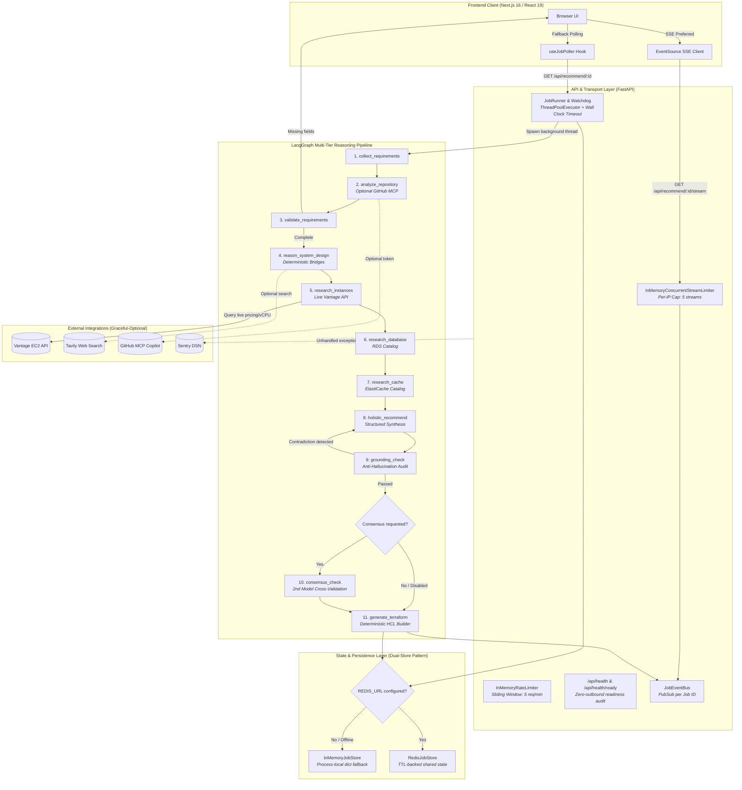

# System Architecture & Technical Decisions

## 1. What This Project Actually Is (and Isn't)

**What it is:** **InfraMind (AWS Instance Advisor)** is an autonomous, multi-tier AWS infrastructure architecture and sizing agent powered by **LangGraph**, **FastAPI**, and **Next.js**. Given freeform application requirements (or a GitHub repository URL), it conducts requirements validation, queries real-time EC2 instance catalog and pricing data via the Vantage API, recommends rightsized compute/database/cache tiers, performs automated Well-Architected reliability/cost audits, runs anti-hallucination consistency checks, and produces complete, deployable Terraform (HCL) configurations.

**What it is not:** It is **not** an unbounded autonomous execution agent that deploys directly to live AWS clouds or executes arbitrary shell code. It does **not** rely on unconstrained LLM hallucinations for Terraform generation or pricing data; all infrastructure configurations, cost boundaries, and engine validations are generated via deterministic, type-safe Python engines grounded in verified cloud provider catalogs.

---

## 2. System Architecture & Component Interactions

---

## 3. Notable Technical Decisions

### Decision 1: Deterministic Terraform Generation over LLM Code Generation
* **Decision:** Terraform (HCL) files (`main.tf`, `variables.tf`, `outputs.tf`) are synthesized deterministically using strictly typed template and string builder modules (`app.agent.nodes.terraform.*`) rather than asking the LLM to write raw HCL code.
* **Alternative Considered:** Prompting the LLM to output freeform `.tf` code blocks or structured JSON representations of HCL.
* **Why Rejected:** LLM-generated Terraform is prone to subtle syntax errors, deprecated provider arguments, non-existent instance types, and dangerous security anti-patterns (e.g. `0.0.0.0/0` ingress on database security groups). Deterministic assembly from validated Pydantic models ensures syntactically valid HCL, exact provider version pinning (`>= 5.73.0`), strict least-privilege security group cross-referencing, and zero additional token latency.

### Decision 2: Server-Sent Events (SSE) over WebSockets for Real-Time Progress
* **Decision:** Streaming real-time job progress via HTTP Server-Sent Events (`GET /api/recommend/{job_id}/stream`) with automated client-side fallback to standard HTTP polling (`GET /api/recommend/{job_id}`).
* **Alternative Considered:** Bidirectional WebSockets (`ws://` / `wss://`).
* **Why Rejected:** WebSockets require sticky load balancer routing, complex connection upgrade handling across enterprise proxies, and custom framing protocols. The interaction model is naturally unidirectional (server pushes stage transitions while the client replies via standard REST `POST /answer` or `POST /followup`). SSE operates over standard HTTP/1.1 and HTTP/2, supports proxy buffering bypass (`X-Accel-Buffering: no`), and has native browser reconnection semantics (`EventSource`).

### Decision 3: Anti-Hallucination Grounding & Self-Verification Pass
* **Decision:** An explicit `grounding_check` node verifies logical coherence between the synthesized `system_design_recommendation` and the extracted `technical_needs` before generating infrastructure code. If contradictions are found (e.g. praising horizontal auto-scaling while min=max=1), the prompt is automatically reconstructed with specific corrective instructions and re-run once.
* **Alternative Considered:** Relying solely on large system prompts to prevent hallucinations during the initial synthesis step.
* **Why Rejected:** Complex multi-tier reasoning frequently exhibits subtle cognitive drift where individual tier choices contradict global workload invariants. An isolated audit step catches and repairs contradictions with a strict one-retry bound, surfacing a visible warning if the check still fails rather than crashing or returning silent corruptions.

### Decision 4: Dual-Store Pattern & Selective State Persistence
* **Decision:** Only user-facing job metadata and terminal results (`job_id`, `status`, `current_stage`, `result`, `retry_info`) are persisted to Redis / memory. The internal executing `AgentState` is kept in process-local memory during execution.
* **Alternative Considered:** Full serialization of the entire LangGraph execution state and candidate lists into Redis on every node transition.
* **Why Rejected:** Full graph state contains large ephemeral candidate sets from live API calls that are redundant to persist. Furthermore, in-flight multi-turn requirement loops rely on the active thread context. The dual-store contract (`JobStoreBackend`) guarantees that completed jobs and public API responses survive process restarts and can be read by any horizontal replica, while avoiding unnecessary state serialization bottlenecks.

### Decision 5: Multi-Model Consensus Scoping (Isolated Verification vs Full Pipeline Re-Run)
* **Decision:** Opt-in consensus mode (`consensus: true`) re-runs **only** the final `holistic_recommend` synthesis against an alternative model (e.g. `CONSENSUS_MODEL`), keeping the upstream requirement collection, system design reasoning, and Vantage live-data candidates identical. Agreement is then evaluated deterministically across tiers.
* **Alternative Considered:** Duplicating and re-executing the entire LangGraph pipeline from start to finish with the second model.
* **Why Rejected:** Re-running upstream nodes doubles Vantage API queries, GitHub repo scans, and web searches while burning twice the token budget without providing extra architectural signal. Re-evaluating only the final holistic decision against the identical candidate set isolates model reasoning differences at the cost of exactly one additional LLM call.

### Decision 6: Graceful-Optional External Integrations
* **Decision:** External dependencies (Redis, Sentry, GitHub MCP, Tavily Web Search, Consensus Model) are strictly optional enhancements. If any service is missing or fails at startup, the system gracefully degrades to process-local defaults (in-memory store, local logging, baseline heuristics) and surfaces integration readiness in `GET /api/health/ready`.
* **Alternative Considered:** Hard startup failure or throwing fatal exceptions whenever an optional integration is unreachable.
* **Why Rejected:** Requiring five distinct external cloud services makes local development, testing, and containerized deployment fragile. A developer needs only `API_KEY`, `BASE_URL`, `MODEL_NAME`, and `VANTAGE_API_KEY` to run a fully functional system.

---

## 4. Operational Invariants & Resiliency Guardrails

1. **Per-IP SSE Concurrency Limiter:** Bounded at 5 concurrent streams per client IP via `InMemoryConcurrentStreamLimiter` to prevent socket exhaustion attacks on the ASGI event loop.
2. **Multi-Key LLM Failover:** Primary -> Secondary (`API_KEY_2`) -> Tertiary (`API_KEY_3`) automatic failover on HTTP 429 rate limit exhaustion.
3. **Structured Output Repair:** JSON Schema-injected prompts with automatic fallback to LangChain JSON-mode and Pydantic validation repairs.
4. **Deterministic Well-Architected Review:** Reliability and cost findings evaluated via static rules without non-deterministic LLM variance.
